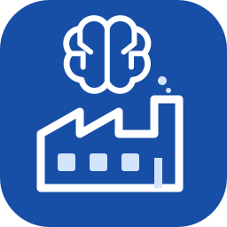

{ width="96" }

# Brain Framework 🧠

**🧠 AI Brain Factory for infinite knowledge. Not for 🐙 mindflayers or 🧟 zombies.**

Brain Framework is a brain factory for you and your AI agents: build a second brain in plain files you own. Find why a decision was made, resume a project after a break, or give a teammate the evidence they need to act. The same knowledge stays available when you change editors or agent hosts.

Markdown notes hold decisions and reusable knowledge; JSON Lines records hold what optional sensors gathered from selected sources. Brain Framework searches both offline and returns readable refs to the original files. You or your agent interpret the evidence and update the notes after work.

Start with one decision worth remembering. Search it, read its source, and keep the note current as the project changes. Sensors are optional: a shared repository of useful notes is already a working knowledge brain.

## A brain for your work

Sensors act like senses, bringing in selected observations. Memories retain that evidence; concepts hold the reusable knowledge you and your agents distill from it. Projects give work a focus, actions hold its context and next step, and routines prepare repeatable reviews.

**Observe → remember → understand → act → review.** This is a way to organize knowledge: you and your agents do the thinking, while Brain Framework stores and retrieves the files. Start with one note and add collection when you need it.

## Connect the tools you already use

Sensors make integrations open-ended: a script can turn data from a CLI, API or file export into searchable memories. Bring in GitHub issues, Jira work items, Airtable records or evidence from your own systems by writing a sensor. The repository provides four examples to adapt: local Git history, local documents, Google Calendar and Drive folders. See [sensors](sensors.md#any-source-you-can-script) for the contract and integration boundaries.

## Small parts, ordinary tools

Use your editor for notes, Git for review, provider CLIs for authentication and a native timer for collection. Brain Framework contributes one command, a rebuildable SQLite cache, browsable pages and two read-only MCP tools. It requires no model, hosted database or background server. Search matches words and explicit identities, optionally within a folder, a period or an identity; it does not generate answers or automatically learn from conversations.

These docs describe Brain Framework 12.0.1. Read the [changelog](https://github.com/fmind/brain-framework/blob/main/CHANGELOG.md) for release changes. Check `bf --version` and follow the [installation guide](getting-started.md) to update an older copy.

## Start with the question you need to answer

| You want to…                               | Start here                                                                                                    |
| ------------------------------------------ | ------------------------------------------------------------------------------------------------------------- |
| Remember why a decision was made           | [Write and retrieve your first decision](getting-started.md#save-a-decision).                                 |
| Give a teammate enough context to continue | [Set up a team brain](team.md) and [check its answers](getting-started.md#check-the-answers-your-team-needs). |
| See what needs attention or changed        | [Read the home page, a period or a source](search.md#pages).                                                  |
| Find a decision or an exact source         | [Search by words or identity](search.md#search).                                                              |
| Bring recurring evidence into the brain    | [Add a scoped sensor](sensors.md).                                                                            |
| Let an agent use the same knowledge        | [Install a workflow skill](getting-started.md#give-agents-access) or connect the [MCP tools](mcp.md).         |
| Resume work and keep decisions explainable | [Follow the agent workflows](agents.md) for actions, evidence captures and dependency review.                 |

The [brain layout](brain.md), [command reference](commands.md), [configuration schema](schema.md) and [security model](privacy.md) cover the details when you need them.
