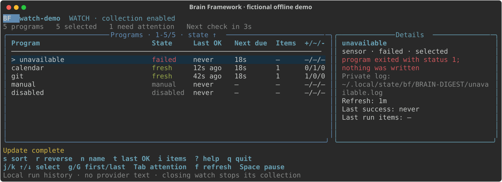

# Watch and schedule updates

Keep reviewed sensors and routines up to date using their `enabled` and `refresh` settings in `bf.yaml`. Start inside your brain directory.

| You want to…                        | Use                                                           |
| ----------------------------------- | ------------------------------------------------------------- |
| Collect while a terminal stays open | `bf watch`; runs due programs immediately.                    |
| Observe another collector           | `bf status --watch`; executes nothing.                        |
| Run unattended on a running host    | `bf schedule`; review and install the generated native files. |

BF installs no background service. [Check your programs](#check-before-scheduling) before starting collection; defaults need no watch preferences file.

## Watch collection

```bash
bf watch
```

This starts due sensors and routines immediately and checks again 60 seconds after each completed cycle. It can contact providers. `--interval SECONDS` changes the check interval (minimum 5); each program's `refresh` still decides when it is due. A failed program retries after 1 minute, then waits twice as long after each consecutive failure, up to its `refresh`, so a persistent failure such as expired credentials does not call its provider every cycle. See [update rules](sensors.md#collect-and-update). Closing the collecting watch stops its collection; it installs nothing. A second interactive watcher observes the existing collector. See [collector ownership](#collector-ownership) before running watch alongside a scheduler.

The dashboard shows each program's last success, next due time, item count and record changes. Items counts records returned by the last successful sensor run, including unchanged records; for window sensors this covers only that run's window, not the total stored catalog. `never` means no success is recorded on this machine; `failed` means the last attempt failed. Manual and disabled programs stay visible without running. Use `bf status --check` for full cache and evidence health.

[](../assets/watch.svg)

This is the fictional [offline watch demo](https://github.com/fmind/brain-framework/tree/main/examples/watch) 42 seconds after its first cycle, sorted by state: `unavailable` failed, `calendar` updated its record, `git` added one, and the manual and disabled sensors stay idle. Your dashboard lists your own sensors and routines.

| Key                   | Effect                                                                                      |
| --------------------- | ------------------------------------------------------------------------------------------- |
| `j` / `k`, arrows     | Select a program and inspect its details.                                                   |
| `g` / `G`, Home / End | Jump to the first / last visible program.                                                   |
| `s`                   | Cycle sort fields in the order listed below.                                                |
| `n` / `t` / `i`       | Sort directly by name / last successful update / item count.                                |
| `r`                   | Reverse the current sort direction; unknown values stay last.                               |
| Tab                   | Toggle programs needing attention: failed, never collected or due.                          |
| `u`                   | Check for due work now; respects refresh, selection and pause. An observer rereads history. |
| Space                 | Pause/resume future updates; an active update finishes. Observers have nothing to pause.    |
| `?`                   | Toggle the guide and explain counts and timing.                                             |
| `q`                   | Cancel any active update and quit successfully. An observer quits without stopping others.  |
| Ctrl-C                | Cancel and exit 130; terminal settings are restored.                                        |

Keys typed faster than the screen redraws, such as a held arrow or a paste, are applied in order.

### Sort the dashboard

The default is name ascending across sensors and routines. The Programs panel title shows the active field and direction, for example `Programs · 1-5/5 · items ↓`: `↑` ascends and `↓` descends. Switching fields chooses its default direction; `r` reverses it. Sorting also works in `bf status --watch` and while the attention filter is active.

| Field (`s` cycle order) | Default order  | Meaning                                                                                               |
| ----------------------- | -------------- | ----------------------------------------------------------------------------------------------------- |
| Name                    | A–Z            | Program name.                                                                                         |
| Last OK                 | Newest first   | Last successful collection or routine update.                                                         |
| Items                   | Largest first  | Records returned by the last successful sensor run.                                                   |
| State                   | Failures first | Failed, never, due, fresh, manual, disabled; uses the underlying state even for excluded programs.    |
| Next due                | Earliest first | Scheduled due time, or a failed program's backoff retry time; manual and disabled programs have none. |
| Changes                 | Largest first  | Added + updated + removed records from the last successful run.                                       |
| Duration                | Slowest first  | Last successful sensor run's elapsed seconds.                                                         |
| Output bytes            | Largest first  | Last successful sensor run's output size.                                                             |
| Refresh                 | Shortest first | Configured interval in seconds; manual (`0`) comes first.                                             |
| Kind                    | Routines first | Routine or sensor.                                                                                    |

Missing values (`—`) always sort last, including routines without sensor metrics; zero is a known value. Failures retain prior successful-run counts. Ties stay alphabetical by name, then kind. The selected program stays selected when sorting or polling moves its row; if it disappears, selection moves to the nearest remaining row. Tab resets selection to the first matching row.

Sort choices last for the current session only and do not change `bf.yaml`, watch preferences, collection order or JSON snapshot order. For example, press `i` to find the largest returned batches, `r` to show the smallest known batches, then `n` to return to alphabetical order. Press `s` until the panel title says `duration` to find slow sensors; select one to inspect its exact timing.

### Terminal and observation

Use an ordinary color terminal of at least 80 columns by 24 rows. From 120 columns, details appear beside the table; narrower terminals put them below, where a failure's error and private log path or a routine's latest action come first. Terminals too short for both keep the program rows. Long program names shorten with `…` so state, ages, due times and counts stay whole; the header, message and key lines shorten instead of wrapping. Colors follow terminal support and `NO_COLOR`; fonts come from your terminal. Text labels remain meaningful without color.

```bash
bf status --watch   # observe only; never executes programs
bf watch --json     # execute due work and emit JSON Lines
```

Use observation alongside a native scheduler. It shows local program history, cannot be combined with `--check` and never probes provider health. Its footer offers `u reread` instead of `u check` and has no pause. Without an interactive terminal, `bf status --watch` fails and suggests `bf status`, which never executes programs. Try the [offline watch demo](https://github.com/fmind/brain-framework/tree/main/examples/watch) for a runnable success/failure exercise.

<details markdown="1">
<summary>Dashboard details and JSON output</summary>

The screen reads small local history files every `poll_interval` (2 seconds by default) without repeatedly indexing the brain or exposing provider text. It redraws after a key, a history read or a resize, and otherwise once a second for relative ages. Sensor details show the last successful run's elapsed seconds, output bytes and reconciliation flag when available. Routines have `*` before their name and show their latest action.

`watch --json` writes a snapshot every `poll_interval` with `brain`, `running`, `message` and `programs`. Each program row has these keys: `kind` (`sensor` or `routine`), `name`, `status`, `included` (in this watch's selection), `refresh`, `success` (last success), `next_due`, `added`, `updated`, `removed`, `elapsed_seconds`, `output_bytes`, `reconcile`, `error`, `log` (its private log path), `action` (a routine's latest action) and `records`, the last successful sensor run's returned item count. `status` is the dashboard state: `failed`, `never` (no success yet), `due`, `fresh`, `manual` (`refresh: 0`) or `disabled`; it differs from the `state` and `freshness` fields of `bf status`. Unknown counts are null; `success` and `next_due` are canonical UTC timestamps ending in `Z`, or empty strings when absent, as for a program that never succeeded, a manual or a disabled one; `error`, `log` and `action` are also empty strings when absent. When an update fails only because the search cache skipped files, `message` says `Search cache skipped N files; run bf validate` and no collection-failure alert is sent. The `running` flag refers to this watch process, which always collects: a JSON watcher never observes, and fails while another watcher owns the brain. A desktop-alert delivery failure also writes one `{"warning": …}` line to stderr.

</details>

## Watch preferences

**No settings file is required.** By default, watch checks due work every 60 seconds, reads local history every 2 seconds and alerts on failures and recovery.

For a quieter session:

```bash
bf watch --interval 300 --notify off
```

To keep those preferences, create `settings/watch.yaml`:

```yaml
# https://fmind.github.io/brain-framework/docs/schedule/#watch-preferences
interval: 300
notifications: off
```

| You want to…              | Change…                                                                       |
| ------------------------- | ----------------------------------------------------------------------------- |
| Check due work less often | `interval` (seconds). Each sensor's `refresh` still determines when it runs.  |
| Change history polling    | `poll_interval` (seconds) for history reads and JSON snapshots, not requests. |
| Choose desktop alerts     | `notifications`: `off`, `failure`, `success` or `all`.                        |
| Space out alerts          | `notification_cooldown` (seconds).                                            |

CLI options override the file; omitted settings use defaults. Restart watch after editing preferences. Sensor `enabled` and `refresh` belong in `bf.yaml` and reload each cycle.

`bf schema --kind watch` prints the installed preferences schema (`title: Settings`), including defaults, units and limits. Use it for [editor validation](schema.md#editor-schemas); watch still validates the file before execution, including values overridden on the CLI.

<details markdown="1">
<summary>Defaults, validation and notification behavior</summary>

| Setting                 | Default   | Accepted values                     |
| ----------------------- | --------- | ----------------------------------- |
| `interval`              | 60        | Integer 5–86400 seconds.            |
| `poll_interval`         | 2         | Number 0.2–60 seconds.              |
| `notifications`         | `failure` | `off`, `failure`, `success`, `all`. |
| `notification_cooldown` | 300       | Integer 0–86400 seconds.            |

- Unknown keys or invalid values fail before execution, even if overridden on the CLI.
- `failure` alerts on new or changed failures and recovery. `success` alerts on completed cycles with work and recovery. `all` includes both.
- Identical failures and idle cycles stay quiet. Cooldown may coalesce transient states; notification state resets on restart.
- Alerts contain generic status, never source names, paths or provider text. `bf status --watch` sends no alerts.
- Desktop notifications need `osascript` on macOS or a Linux notification service with `notify-send` or `gdbus`. ChromeOS/WSL need a working bridge. Delivery failure warns once without stopping collection; desktop settings may suppress display.

</details>

## Select programs

Repeat `--sensor` and `--routine` on `update`, `watch` or `schedule`:

```bash
bf update --sensor git-commits --dry-run
bf watch --sensor git-commits --routine weekly-review
bf schedule --sensor git-commits --name git-only
```

Substitute names from your `bf.yaml`. With no selectors, all configured programs are eligible, including programs added later. With any selector, **only named programs** are eligible; for example `--sensor git-commits` excludes every routine and every other sensor. Unknown names fail before execution; disabled programs and `refresh: 0` stay excluded. Selectors never force a run or modify configuration. Referenced brains never execute.

## Generate a native schedule

```bash
bf schedule --every 15 --output settings/schedules
```

The result contains `files`, `written` paths, the command `argv`, and literal argv lists named `install`, `status` and `remove`. It writes native files; it does not run those commands. Without `--output`, it only previews the result as JSON: `written` is empty, its install commands name the files `--output settings/schedules` would write, and a `Preview only` warning says to write them first. A relative `--output`, such as `settings/schedules`, resolves against the brain root, not the current directory. Existing identical files are safe to regenerate; differing files are preserved and generation fails, so review your edits or generate to a fresh directory. An output directory can live outside the brain too.

Generated files capture this machine's `PATH`, home and brain paths, and are useless on another machine. Keep them out of a shared brain's Git history, for example with a `/settings/schedules/` line in its `.gitignore`, or generate them outside the brain.

| Option/default         | Meaning                                                                                                                                                                                                         |
| ---------------------- | --------------------------------------------------------------------------------------------------------------------------------------------------------------------------------------------------------------- |
| `--backend auto`       | launchd on macOS; systemd on Linux when `systemctl` is on PATH; otherwise cron. Detection does not prove the scheduler is running.                                                                              |
| `--every 15`           | Check every 15 minutes. Supported minute intervals divide an hour: 1, 2, 3, 4, 5, 6, 10, 12, 15, 20, 30, 60.                                                                                                    |
| `--name update`        | Job suffix; use different names for different selections. Brain identity and path also distinguish generated jobs.                                                                                              |
| `--executable PATH`    | Absolute installed `bf`; default is beside the running Python. Regenerate if that installation moves.                                                                                                           |
| PATH and XDG locations | Capture absolute PATH entries and a set `XDG_CONFIG_HOME`/`XDG_STATE_HOME` with `~` expanded; like every command, ignore empty and relative values. Credentials and other environment variables are not copied. |

Generation rejects control characters in paths/environment values, quotes or backslashes in a systemd executable path, and combined backslashes/percent signs that cron cannot safely represent. Use a simpler installation path or another backend in those cases.

Review the programs and generated environment, then follow the returned installation commands when you want recurring execution. Configure provider authentication separately. Those argv arrays are data: quote arguments if translating them to shell commands. For cron, copy the single generated job line into `crontab -e`; **do not run `crontab FILE`**, which replaces existing jobs. For systemd, verify with `systemd-analyze --user verify FILE.service FILE.timer`; for launchd use `plutil -lint FILE.plist` before installation.

<details markdown="1">
<summary>Scheduler limits and host lifecycle</summary>

Systemd definitions use calendar triggers, missed-trigger catch-up and up to 30 seconds of jitter. LaunchAgents use calendar minute triggers so sleep-time occurrences coalesce on wake; missed power-off runs are not replayed. Cron skips missed occurrences. Every backend relies on per-program BF `timeout` settings; none adds a total-job timeout, so a cycle of several long programs is not killed midway. An enabled schedule does not prove collection success: inspect native job results and `bf status --check` on the collecting machine.

On Linux use a working systemd user manager when available; macOS uses a logged-in user's LaunchAgent. ChromeOS runs BF inside its Linux environment, whose processes stop at logout. WSL needs a running distribution; systemd services do not keep it alive. Generation supports these native formats, but cannot guarantee an always-running host. See the [ChromeOS lifecycle documentation](https://www.chromium.org/chromium-os/developer-library/guides/containers/containers-and-vms/#lifecycles), [WSL systemd documentation](https://learn.microsoft.com/en-us/windows/wsl/systemd) and [Apple scheduling guidance](https://developer.apple.com/library/archive/documentation/MacOSX/Conceptual/BPSystemStartup/Chapters/ScheduledJobs.html).

</details>

Keep arbitrary backup scripts or other non-BF jobs in their own native files beside these definitions. Edit those files directly using the native scheduler's rules; BF does not add a generic task schema or execute arbitrary schedule commands.

## Collector ownership

If another watcher owns this physical brain, a second interactive `bf watch` observes it. Its selectors mark other programs `excluded` in this view only; the active collector keeps its own selection and settings. The observer does not take over when the collector exits: restart watch to collect. A competing `watch --json` fails visibly so a supervisor can retry.

Use one execution owner per selected program. Concurrent `update` cycles on the same brain run one at a time: named schedules for different selections fire at the same minutes, so the second cycle waits up to 10 minutes for the first, then computes its own due list. If the first is still running after that, the second fails visibly with `another update is still active` instead of duplicating a due list. Manual `collect` retains its own per-program lock. Use `bf status --watch` when a timer owns collection; timer ownership cannot be detected by the watch lock. Removing a schedule requires both stopping future triggers and accounting for an active update; the returned removal commands cover both for systemd/launchd. Removing a cron line stops future triggers only.

## Check before scheduling

From `~/brain`, check the programs before installing a timer:

```bash
bf update --dry-run    # list due work; execute nothing
bf update              # run due sensors, then routines
bf status --check
```

The preview lists due sensors and routines without executing them. The next command runs them; a healthy `bf status --check` exits 0. Review the configured programs before that run. Set `enabled: false` to stop one program, or `refresh: 0` to keep a sensor manual. Updates act on the one selected brain, never its referenced brains.

## macOS and CI

On macOS, use `bf schedule --backend launchd` and follow the [generated schedule](#generate-a-native-schedule) workflow. It supplies calendar triggers and absolute program arguments. Keep CI for offline validation and evaluation without provider credentials.

For a shared source, designate one collecting laptop. See [team collection](team.md#collect-on-a-laptop).

## Timing and health

After a backward clock correction, a success timestamp in the future is stale and the program is due again. Reconciliation also retries if its last timestamp is in the future. Long pauses catch up at most 30 days before any configured reconciliation window is applied.

Choose a timer interval shorter than the smallest nonzero `refresh`. With an hourly sensor and a 15-minute timer, a check 59 minutes after the last success skips the sensor; the next check at 74 minutes runs it. An hourly timer could leave it waiting until minute 119.

`Persistent=true` catches up missed calendar triggers when the user manager returns; it does not keep a sleeping laptop awake. A failed program is due again after its failure backoff. With a 15-minute timer and an hourly sensor, each retry runs at the first check at least 1, 2, 4, 8, 16, 32 and then 60 minutes after the previous failure; the first four retries therefore wait only for the next check.

`bf status --check` exits 1 for an enabled scheduled program that failed, never succeeded locally, has a future success timestamp, or last succeeded more than twice its `refresh` ago. Run this check on the collecting machine: run history is local, even when records are shared.
